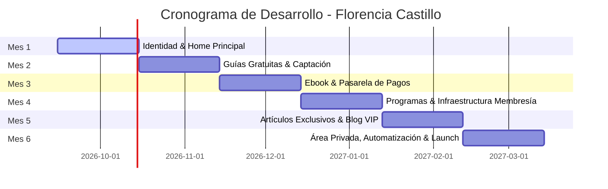

# 📁 PROYECTO: FLORENCIA CASTILLO · MUJERES ALFA
### Documento Maestro de Trabajo & Roadmap del Ecosistema Digital
*Agencia: VIREL. | Estado: Activo / Contratado*

---

## 1. FICHA TÉCNICA DEL PROYECTO

* **Cliente:** Florencia Castillo
* **Marca / Proyecto:** Mujeres Alfa
* **Instagram:** [@florenciacastillo.oficial](https://www.instagram.com/florenciacastillo.oficial/)
* **Nicho / Enfoque:** Desarrollo personal y empresarial para mujeres
* **Audiencia Objetivo:** Mujeres de 28 a 50 años (emprendedoras, profesionales o en transición) que buscan liderazgo, claridad, dirección y crecimiento económico/personal sin clichés.
* **Propuesta de Valor:** Transformar el potencial de mujeres profesionales en liderazgo real y negocios estructurados con resultados medibles.
* **Tagline:** *"Poder. Claridad. Resultados."*
* **Condiciones Comerciales:**
  * Inversión mensual: **$440.000 ARS / mes** (Precio promocional lanzamiento 20% OFF).
  * Plazo total: **6 meses de desarrollo y acompañamiento continuo**.
  * Modalidad de cobro: **Pago mensual del 1 al 10**.
  * Dinámica: **Reuniones semanales de trabajo (2 horas)** + seguimiento activo.

---

## 2. BRAND KIT & GUÍA DE IDENTIDAD VISUAL (APROBADO)

### 🎨 Paleta de Colores Oficial ("Opción Magnética")

| Color | Hex | % Uso | Aplicación en el Ecosistema |
|---|---|---|---|
| **Fuchsia Intenso** | `#D4006A` | 35% | Color primario de impacto, botones principales (CTA), títulos destacados, fondos de secciones clave. |
| **Marfil / Hueso** | `#FAF0E4` | 25% | Fondo base principal de todo el sitio, tarjetas y páginas. Aporta elegancia, respiro y calidez. |
| **Coral Energético** | `#FF5C45` | 20% | Botones secundarios, badges de estado, destacados, acentos y llamadas a la acción complementarias. |
| **Naranja Cálido** | `#FF9A3C` | 10% | Íconos, viñetas, badges de oferta/lanzamiento, detalles sutiles de calidez. |
| **Carbón Suave** | `#2B2435` | 10% | Tipografía de lectura (párrafos), títulos oscuros, estructura y pie de página (footer). |

> **Regla de oro visual:** Prohibido el uso de blanco puro (`#FFFFFF`) y negro absoluto (`#000000`). La base siempre respira sobre Marfil (`#FAF0E4`) y contrasta con Carbón (`#2B2435`) y Fuchsia (`#D4006A`).

---

### 🔤 Sistema Tipográfico

1. **Titulares & Display (Jerarquía Principal):**
   * **Fuente:** `Cormorant Garamond` (Google Fonts).
   * **Estilos:** Bold / SemiBold / Italic.
   * **Uso:** Nombres principales, frases de impacto, títulos de sección H1 y H2.

2. **Cuerpo, Navegación & UI (Lectura & Funcionalidad):**
   * **Fuente:** `DM Sans` (Google Fonts).
   * **Estilos:** Regular (400) / Medium (500) / SemiBold (600).
   * **Uso:** Párrafos descriptivos, botones, menús de navegación, formularios, paneles privados y tablas de precios. Ultra legible en mobile.

---

### 🎙️ Tono & Voz de Marca

* **Poderosa:** Habla con convicción y autoridad. No pide permiso ni usa lenguaje dubitativo (*"quizás"*, *"tal vez"*).
* **Estratégica:** Enfoque práctico y orientado a resultados. No es autoayuda abstracta, es crecimiento con método.
* **Cálida & Cercana:** Acompaña de igual a igual, entiende los bloqueos de su comunidad y genera pertenencia.

---

## 3. ARQUITECTURA DEL ECOSISTEMA DIGITAL

El ecosistema está diseñado bajo un embudo de conversión continuo:
$$\text{Tráfico (Redes)} \longrightarrow \text{Guía Gratuita (Lead)} \longrightarrow \text{Ebook/Artículos} \longrightarrow \text{Programas / Mentorías / Membresía}$$

```
                                [ Instagram / Redes ]
                                          │
                                          ▼
                         [ Sitio Web Oficial - Home ]
                                          │
                  ┌───────────────────────┴───────────────────────┐
                  ▼                                               ▼
         [ Guías Gratuitas ]                            [ Ebook Digital ]
       (Captación de Emails)                          (Venta automatizada MP)
                  │                                               │
                  └───────────────────────┬───────────────────────┘
                                          │
                                          ▼
                        [ Programas & Mentorías ]
                             (Plan A / Plan B)
                                          │
                                          ▼
                       [ Área Privada & Membresía ]
                   (Login, contenido exclusivo y cobro)
```

### Módulos a Desarrollar:

1. **Sitio Principal (Home Hub):**
   * Presentación de Florencia y manifiesto de Mujeres Alfa.
   * Acceso centralizado a todos los productos y servicios.
   * Prueba social, cifras de impacto (ej. *+950 mujeres transformadas*) y testimonios.
   * Formulario de contacto y enlaces directos a WhatsApp.
   * Optimización 100% Mobile First.

2. **Módulo de Captación (Guías Gratuitas / Lead Magnets):**
   * Landing pages específicas de descarga.
   * Temáticas: *Mindset / Amor Propio* y *Mujeres Emprendedoras*.
   * Formulario con integración a plataforma de Email Marketing para entrega automática y bienvenida.

3. **Módulo de Monetización Inicial (Ebook Digital):**
   * Landing de venta con copy persuasivo.
   * Integración de pasarela de pago (Mercado Pago con checkout transparente o link directo).
   * Flujo automático: Pago confirmado $\rightarrow$ Envío de PDF por email $\rightarrow$ Habilitación en el Área Privada.

4. **Módulo de Programas & Mentorías:**
   * Páginas dedicadas a programas individuales y grupales (Plan A / Plan B).
   * Sistema de postulación o botón de reserva directa vía WhatsApp/Calendly.

5. **Módulo Editorial (Artículos & Contenido de Valor):**
   * Blog con dos niveles de contenido:
     * *Artículos públicos:* Para posicionamiento orgánico y atracción.
     * *Artículos exclusivos:* Con candado de acceso solo para miembros.

6. **Área Privada de Miembros (Plataforma Web):**
   * Sistema de autenticación (Registro / Login con correo y contraseña).
   * Panel de control de la alumna/socia: biblioteca de recursos, descargas de ebooks, acceso a artículos VIP y estado de su suscripción.

7. **Automatizaciones & Panel de Control Interno:**
   * Secuencias de correos automatizadas (Bienvenida, Entrega de recursos, Avisos de cobro).
   * Panel administrativo simple para que Florencia pueda ver miembros activos, ventas y altas.

---

## 4. ROADMAP DE IMPLEMENTACIÓN (6 MESES)



### Detalle de Etapas:

* **MES 1 — Cimientos & Home:**
  * Definición final de dominio y hosting.
  * Maquetación y desarrollo del Sitio Principal (Home) responsive.
  * Aplicación del Brand Kit oficial (Cormorant Garamond + DM Sans + Paleta Magnética).
  * *Entregable:* Home funcional online en entorno de staging/producción.

* **MES 2 — Captación de Audiencia:**
  * Diseño maquetado de 2 guías gratuitas (PDFs con estética de marca).
  * Páginas de captura (Opt-in) con formularios.
  * Configuración de la base de datos de correos (Mailchimp / Brevo).
  * *Entregable:* Sistema de captación de leads funcionando de punta a punta.

* **MES 3 — Producto Digital & Venta:**
  * Diseño y maquetación visual del Ebook de Florencia.
  * Landing page de venta del Ebook.
  * Integración de pasarela de cobro (Mercado Pago).
  * Automatización del correo post-compra con entrega de archivo.
  * *Entregable:* Primer producto de pago facturando de manera autónoma.

* **MES 4 — Programas & Estructura de Membresía:**
  * Presentación y landings de los programas de mentoría (Plan A / Plan B).
  * Configuración de infraestructura para cobro de suscripciones recurrentes.
  * *Entregable:* Páginas de servicios de alto valor listas para recibir postulaciones.

* **MES 5 — Contenido Exclusivo:**
  * Estructura del Blog / Revista digital.
  * Configuración de accesos públicos vs. restringidos (Paywall / Candado para socias).
  * Carga de primeros artículos modelo.
  * *Entregable:* Sección de contenidos activa con filtrado por membresía.

* **MES 6 — Área Privada, Automatizaciones & Lanzamiento Integral:**
  * Área de miembros con Login / Password.
  * Centralización de biblioteca de contenidos y compras.
  * Panel de gestión interno para Florencia.
  * **Prueba integral del ecosistema:** Auditoría de flujos (registro, pago, email, login, mobile).
  * *Entregable:* Ecosistema digital 100% operativo y entregado.

---

## 5. CHECKLIST DE INSUMOS (REQUERIMIENTOS PARA FLOR)

Para avanzar ordenadamente en cada reunión semanal, estos son los insumos que Flor debe ir entregando:

- [ ] **Acceso a Dominio:** Decidir si será `florenciacastillo.com`, `mujeresalfa.com` o variante (y credenciales si ya lo tiene).
- [ ] **Material Fotográfico:** Carpeta de Google Drive con fotos profesionales en alta resolución (retratos, planos medios, trabajando, estilo de vida).
- [ ] **Textos Base del Home:** Biografía / historia de Florencia, frase principal, resumen de su metodología.
- [ ] **Contenido de Guías Gratuitas:** Borrador de textos de las 2 guías para que VIREL las maquete.
- [ ] **Contenido del Ebook:** Manuscrito/texto del ebook para estructurar su diseño y venta.
- [ ] **Cuenta de Mercado Pago:** Cuenta habilitada y verificada para vincular la API de cobros.
- [ ] **Testimonios:** Capturas, citas o videos de alumnas de sus mentorías anteriores.

---

## 6. DINÁMICA DE TRABAJO SEMANAL

1. **Reunión Semanal de Avance (2 horas fijas):**
   * *Primera hora:* Revisión de entregables de la semana y validación en vivo.
   * *Segunda hora:* Planificación de contenidos de la siguiente etapa y resolución de dudas estratégicas.
2. **Canal de Soporte Directo:** WhatsApp / Email para consultas ágiles entre reuniones.
3. **Control de Pagos:** Registro mensual del 1 al 10 de cada ciclo.
